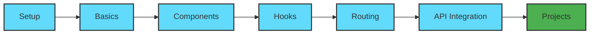

<div align="center">


# 🚀 React Journey

### *Your Complete Path to Mastering React.js*

<p align="center">
  
  
  
</p>

<p align="center">
  <a href="#-about">About</a> •
  <a href="#-getting-started">Getting Started</a> •
  <a href="#-features">Features</a> •
  <a href="#-roadmap">Roadmap</a> •
  <a href="#-contributing">Contributing</a>
</p>

<p align="center">
  
  
  
</p>

</div>

---

## 🎯 About

**React Journey** is your comprehensive companion for mastering React development. This repository transforms beginners into confident React developers through hands-on projects, real-world examples, and progressive learning challenges.

### Why Choose React Journey?

<table>
<tr>
<td width="33%" align="center">

### 📚 Structured Learning
Progressive curriculum from basics to advanced concepts

</td>
<td width="33%" align="center">

### 💻 Practical Projects
Real-world applications with production-quality code

</td>
<td width="33%" align="center">

### 🎨 Modern React
Latest features, hooks, and best practices

</td>
</tr>
</table>

---

## ✨ Features

<div align="center">

| Feature | Description |
|:--------|:------------|
| 🚀 **Beginner Friendly** | No prior React experience needed - just JavaScript basics |
| 📖 **Well Documented** | Every concept explained with comments and guides |
| 🎯 **Project-Based** | Learn by building real applications |
| 🔧 **Modern Stack** | React Hooks, Context API, Router, and more |
| 🌟 **Best Practices** | Industry-standard patterns and code organization |
| 🤝 **Open Source** | Community-driven learning and contributions |

</div>

---

## 🗺️ Learning Path



<div align="center">

### 📚 Curriculum Overview

</div>

<details>
<summary><b>🟢 Phase 1: Foundations</b></summary>

- Environment Setup & Configuration
- JSX Syntax & React Elements
- Functional & Class Components
- Props & State Fundamentals
- Event Handling Basics

</details>

<details>
<summary><b>🔵 Phase 2: Core Concepts</b></summary>

- React Hooks (useState, useEffect, useContext)
- Conditional Rendering Techniques
- Working with Lists & Keys
- Forms & Controlled Components
- Component Lifecycle Methods

</details>

<details>
<summary><b>🟣 Phase 3: Advanced Topics</b></summary>

- Context API & Global State
- React Router & Navigation
- API Integration & Data Fetching
- Custom Hooks Development
- Performance Optimization

</details>

<details>
<summary><b>🟠 Phase 4: Real Projects</b></summary>

- Todo App with Local Storage
- Weather Dashboard with API
- E-commerce Product Catalog
- Social Media Feed
- Full-Stack CRUD Application

</details>

---

## 🛠️ Tech Stack

<div align="center">


</div>

---

## 🚀 Getting Started

### Prerequisites

Ensure you have the following installed on your system:

```bash
node --version  # v14.0 or higher
npm --version   # v6.0 or higher
```

### Installation

<table>
<tr>
<td>

**Step 1:** Clone the repository

```bash
git clone https://github.com/arpan7sarkar/React_Journey.git
```

</td>
</tr>
<tr>
<td>

**Step 2:** Navigate to project directory

```bash
cd React_Journey
```

</td>
</tr>
<tr>
<td>

**Step 3:** Install dependencies

```bash
npm install
```

</td>
</tr>
<tr>
<td>

**Step 4:** Start development server

```bash
npm start
```

</td>
</tr>
<tr>
<td>

**Step 5:** Open in browser

```
http://localhost:3000
```

</td>
</tr>
</table>

### Quick Commands

```bash
npm start       # Run development server
npm test        # Launch test runner
npm run build   # Create production build
```

---

## 📁 Project Structure

```
React_Journey/
│
├── 📂 public/              # Static assets
│   ├── index.html
│   └── favicon.ico
│
├── 📂 src/                 # Source files
│   ├── 📂 components/      # Reusable components
│   │   ├── Header.js
│   │   ├── Footer.js
│   │   └── ...
│   │
│   ├── 📂 pages/           # Page components
│   │   ├── Home.js
│   │   ├── About.js
│   │   └── ...
│   │
│   ├── 📂 hooks/           # Custom hooks
│   │   └── useFetch.js
│   │
│   ├── 📂 context/         # Context providers
│   │   └── AppContext.js
│   │
│   ├── 📂 styles/          # Stylesheets
│   │   ├── App.css
│   │   └── index.css
│   │
│   ├── App.js              # Main component
│   └── index.js            # Entry point
│
├── package.json            # Dependencies
└── README.md              # Documentation
```

---

## 💡 Code Examples

<details>
<summary><b>🎯 Counter Component (useState)</b></summary>

```javascript
import React, { useState } from 'react';

function Counter() {
  const [count, setCount] = useState(0);

  return (
    <div className="counter">
      <h2>Count: {count}</h2>
      <button onClick={() => setCount(count + 1)}>
        ➕ Increment
      </button>
      <button onClick={() => setCount(count - 1)}>
        ➖ Decrement
      </button>
      <button onClick={() => setCount(0)}>
        🔄 Reset
      </button>
    </div>
  );
}

export default Counter;
```

</details>

<details>
<summary><b>🌐 Data Fetching (useEffect)</b></summary>

```javascript
import React, { useState, useEffect } from 'react';

function UserList() {
  const [users, setUsers] = useState([]);
  const [loading, setLoading] = useState(true);

  useEffect(() => {
    fetch('https://api.example.com/users')
      .then(res => res.json())
      .then(data => {
        setUsers(data);
        setLoading(false);
      })
      .catch(err => console.error(err));
  }, []);

  if (loading) return <div>⏳ Loading...</div>;

  return (
    <ul className="user-list">
      {users.map(user => (
        <li key={user.id}>👤 {user.name}</li>
      ))}
    </ul>
  );
}

export default UserList;
```

</details>

<details>
<summary><b>🔧 Custom Hook (useFetch)</b></summary>

```javascript
import { useState, useEffect } from 'react';

function useFetch(url) {
  const [data, setData] = useState(null);
  const [loading, setLoading] = useState(true);
  const [error, setError] = useState(null);

  useEffect(() => {
    setLoading(true);
    fetch(url)
      .then(res => res.json())
      .then(data => {
        setData(data);
        setLoading(false);
      })
      .catch(err => {
        setError(err);
        setLoading(false);
      });
  }, [url]);

  return { data, loading, error };
}

export default useFetch;
```

</details>

---

## 🗓️ Roadmap

<div align="center">

| Status | Feature |
|:------:|:--------|
| ✅ | Basic React Setup |
| ✅ | Component Fundamentals |
| ✅ | Hooks Implementation |
| 🚧 | State Management (Redux/Zustand) |
| 📋 | TypeScript Integration |
| 📋 | Testing Suite (Jest/RTL) |
| 📋 | Next.js & SSR |
| 📋 | Animation Libraries |
| 📋 | PWA Features |

</div>

---

## 🤝 Contributing

Contributions are what make the open-source community amazing! We welcome all contributions.

<div align="center">

### How to Contribute

</div>

```bash
# Fork the repo
# Create your feature branch
git checkout -b feature/AmazingFeature

# Commit your changes
git commit -m 'Add some AmazingFeature'

# Push to the branch
git push origin feature/AmazingFeature

# Open a Pull Request
```

**Contribution Guidelines:**
- Write clean, commented code
- Follow existing conventions
- Test thoroughly before submitting
- Update documentation as needed

---

## 👨‍💻 Author

<div align="center">


### Arpan Sarkar

*BTech AI & ML Student @ Brainware University '28*

[](https://in.linkedin.com/in/arpan7sarkar)
[](https://github.com/arpan7sarkar)

</div>

---

## 🙏 Acknowledgments

<div align="center">

Special thanks to these amazing resources:

[React Docs](https://react.dev) • 
[MDN Web Docs](https://developer.mozilla.org) • 
[Create React App](https://create-react-app.dev) • 
[React Icons](https://react-icons.github.io)

</div>

---

## 📄 License

<div align="center">

Distributed under the **MIT License**. See `LICENSE` for more information.


</div>

---

## 📊 Stats

<div align="center">


</div>

---

<div align="center">

### ⭐ If you find this helpful, please star the repository!

**Made with ❤️ and ☕ by [Arpan Sarkar](https://github.com/arpan7sarkar)**


*Happy Learning! Keep Building! 🚀*

</div>